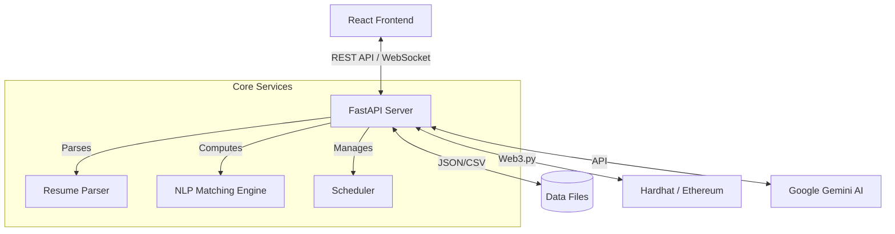

# 🎓 MentorNexus

**Decentralized Mentorship Matching Platform**

MentorNexus is a cutting-edge platform designed to bridge the gap between students and faculty researchers. By leveraging **Natural Language Processing (NLP)** for semantic matching and **Blockchain** for immutable record-keeping, it ensures fair, transparent, and efficient mentorship connections.

---

## 🏗️ Architecture

The system follows a modern 3-tier architecture:



---

## 🚀 Key Features

### 1. 🧠 AI-Powered Matching
-   **Semantic Analysis**: Uses TF-IDF with a fallback mechanism of Cosine Similarity to match student research interests with faculty publications.
-   **Resume Parsing**: Automatically extracts skills and interests from student resumes (PDF) using Google Gemini AI.
-   **Weighted Scoring**: Matches based on Research Similarity, Skill Overlap, Availability, and Urgency.

### 2. 🔗 Blockchain Registry
-   **Start Contract**: `MatchRegistry.sol`
-   **Immutability**: Every finalized match is hashed and stored on a local Ethereum blockchain (Hardhat).
-   **Auditability**: Ensures that match records cannot be altered or tampered with.

### 3. 📊 Analytics & Insights
-   **Faculty Dashboard**: Visualizes demand vs. supply, top student skills, and trending research interests.
-   **Real-time Data**: Aggregates data from the underlying CSV datasets.

### 4. 💬 Real-time Collaboration
-   **WebSocket Chat**: Instant messaging between students and faculty (simulated).
-   **Automated Scheduling**: Integration for booking interview slots directly from the match results.

### 5. ⚡ Dynamic Data Management
-   **Dataset-Driven**: Faculty and project data are loaded dynamically from `faculty_dataset.csv`.
-   **Admin Tools**: Interfaces to contribute new data without code changes.

---

## 🛠️ Tech Stack

| Component | Technology |
| :--- | :--- |
| **Frontend** | React, Vite, CSS Modules, Chart.js, React-Calendar |
| **Backend** | Python, FastAPI, Pandas, Scikit-learn, Web3.py |
| **Blockchain** | Solidity, Hardhat, Ethers.js |
| **AI / NLP** | Google Gemini 2.0 Flash, TF-IDF Vectorizer |
| **Database** | CSV / JSON (File-based persistence) |

---

## 📋 Prerequisites

-   **Node.js** (v16+)
-   **Python** (v3.9+)
-   **Git**

---

## ⚙️ Installation & Execution

Follow these steps to run the complete system locally.

### 1. Clone the Repository
```bash
git clone https://github.com/1Gaurav26/MentorNexus.git
cd Mentornexus
```

### 2. ⛓️ Start Blockchain (Terminal 1)
Start the local Hardhat node and deploy the smart contracts.

```bash
cd backend/blockchain
npm install
npx hardhat node
```
*Keep this terminal running. It will display the deployed contract address and local accounts.*

### 3. 🐍 Start Backend (Terminal 2)
Set up the Python environment and run the API server.

```bash
# From root directory
cd backend

# Create virtual environment (optional but recommended)
python -m venv venv
# Windows:
venv\Scripts\activate
# Mac/Linux:
source venv/bin/activate

# Install dependencies
pip install -r requirements.txt

# Configure Environment Variables
# Create a .env file in backend/ directory with:
# GEMINI_API_KEY=your_api_key_here
# BLOCKCHAIN_RPC=http://127.0.0.1:8545
# CONTRACT_ADDRESS=0x... (from Terminal 1)
# PRIVATE_KEY=0x... (from Terminal 1 Account #0)

# Run Server
cd ..
uvicorn backend.app.main:app --reload --host 0.0.0.0 --port 8000
```

### 4. 💻 Start Frontend (Terminal 3)
Launch the user interface.

```bash
cd frontend
npm install
npm run dev
```
Access the application at `http://localhost:5173`.

---

## 📂 Project Structure

```
Mentornexus/
├── backend/
│   ├── app/                # Application Logic
│   │   ├── main.py         # API Entry point
│   │   ├── nlp.py          # Matching Engine
│   │   ├── resume_parser.py# AI Resume Parser
│   │   └── scheduler.py    # Scheduling Logic
│   ├── blockchain/         # Hardhat Project
│   │   ├── contracts/      # Solidity Contracts
│   │   └── scripts/        # Deploy Scripts
│   └── data/               # CSV Datasets
├── frontend/
│   ├── src/
│   │   ├── pages/          # React Views
│   │   ├── components/     # Reusable UI
│   │   └── api/            # API Client
└── README.md
```

---

## 🤝 Contributing

1.  Fork the repository.
2.  Create a feature branch (`git checkout -b feature/AmazingFeature`).
3.  Commit your changes (`git commit -m 'Add some AmazingFeature'`).
4.  Push to the branch (`git push origin feature/AmazingFeature`).
5.  Open a Pull Request.

---

## 📄 License

Distributed under the MIT License. See `LICENSE` for more information.
